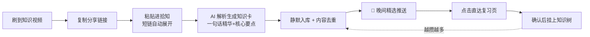

<div align="center">

# 拾知 ShiZhi 🌿

**短视频知识碎片消化器 —— 专治「收藏了从不回看」**

刷到知识视频，只需粘贴链接，AI 替你先看一遍；<br>
每晚到点，把当天最值得回看的几条送到你手机主屏，其余静默入库、零打扰。


</div>

---

## 🕳️ 为什么做拾知

我们刷到有价值的知识视频，当下没空看，就顺手存进收藏夹、转给文件传输助手——然后，再也没有然后了。

数据显示，收藏内容的回看率**不到 5%**。收藏完成的不是学习，是心理安慰：收藏夹是一个没有提醒、没有整理的黑洞。

拾知补上「存得进 → 看得懂 → 记得回」这一环：**不只替你存，更替你消化**。

## ⚙️ 它是怎么工作的



**用户侧只保留「粘贴」一个动作**，解析、挑选、归类全部后台完成。

## ✨ 核心功能

| 功能 | 说明 |
| --- | --- |
| 🔗 一键导入 | 粘贴链接即可；B站 / 抖音 / 小红书 / YouTube / 微博短链自动展开 |
| 🤖 AI 知识卡 | 三种生成模式：**智能卡**（单次请求直出卡片）、**简洁卡**（默认总结+本地解析）、**精制卡**（两步请求精修），产出标题+一句话精华+核心要点 |
| 🚫 内容去重 | 按 BV 号 / YouTube ID / 规范化 URL 识别同一内容，重复导入自动拦截，不浪费 API 额度 |
| 🌙 晚间精选推送 | 每晚从当日新增中挑选约 20%（至少 1 条）最值得回看的知识，默认 21:00 推送、时间可自定义；没上屏的不打扰，全在 App 里等你 |
| 🌳 知识树 | 复习确认后知识点才挂上树——存进树里的，都是真正消化过的 |
| 📅 打卡日历 | 完成当日回顾即打卡，按月圆点展示 |
| 💰 额度管理 | 「我的」页直接查询 BibiGPT 账号余额、测试推送 |

## 📁 仓库结构

```
shizhi/
├── mobile/       # 拾知 App（Expo + React Native，iOS / Android）
│   └── src/
│       ├── screens/   # 首页 / 详情 / 复习 / 知识树 / 我的 / 打卡日历
│       ├── api.ts     # BibiGPT 开放 API 封装（短链展开/三种卡片模式）
│       ├── notify.ts  # 晚间精选推送（expo-notifications）
│       ├── store.ts   # 全局状态 + AsyncStorage 持久化
│       └── card.ts    # 知识卡生成与解析
├── typescript/   # BibiGPT API 最小闭环 Demo（CLI：查余额/总结/抓字幕）
├── python/       # 预留
└── docs/         # 预留
```

## 🚀 快速开始

### 准备：获取 API Token

1. 打开 [bibigpt.co/user/integration](https://bibigpt.co/user/integration) 注册并获取 API Token

### 手机 App（mobile/）

```bash
cd mobile
npm install
npx expo start
```

- 首次启动后在「我的」页填入你的 BibiGPT API Token
- 基础功能可在 Expo Go 中体验；**晚间推送需开发构建**（SDK 53+ 的 Expo Go 不含 expo-notifications 原生实现）：

```bash
npx expo run:android   # 或 npx expo run:ios
```

### API 命令行 Demo（typescript/）

```bash
export BIBIGPT_API_TOKEN=你的token   # Windows: set BIBIGPT_API_TOKEN=你的token
cd typescript
npm install
npm start
```

交互式菜单支持：① 查询账号额度 ② 链接总结（B站/YouTube/文件直链）③ 字幕抓取。Node 18+ 即可运行，零第三方运行时依赖。

## 🛠️ 技术栈

- **App**：Expo 57 · React Native 0.86 · React 19 · TypeScript · AsyncStorage · expo-notifications
- **AI 能力**：[BibiGPT 开放 API](https://bibigpt.co)（视频总结 / 字幕抓取 / 短链展开 / 自定义 Prompt）
- **Demo**：Node 18+ 原生 fetch，tsx 直跑 TypeScript

## 🗺️ 路线图

| 版本 | 主题 | 内容 |
| --- | --- | --- |
| **V1 · 当前** | 最短消化闭环 | 链接导入 + AI 知识卡 + 知识库 + 晚间精选推送 ✅ |
| V2 | 知识体系 | 知识树网状可视化、桌面小组件 |
| V3 | 知识飞轮 | AI 读取个人知识库 + 博主过往文案风格，辅助选题与初稿——一个越用越懂你的「AI 替身」 |

> 普通用户用拾知攒习惯，重度创作者用拾知攒弹药：**刷到 → 存进 → 长成库 → 写出来**，这就是拾知的知识飞轮。

## 🙏 致谢

- [BibiGPT 开放 API](https://bibigpt.co) —— 视频解析与总结能力
- 本项目为黑客松参赛作品（2026.08）

